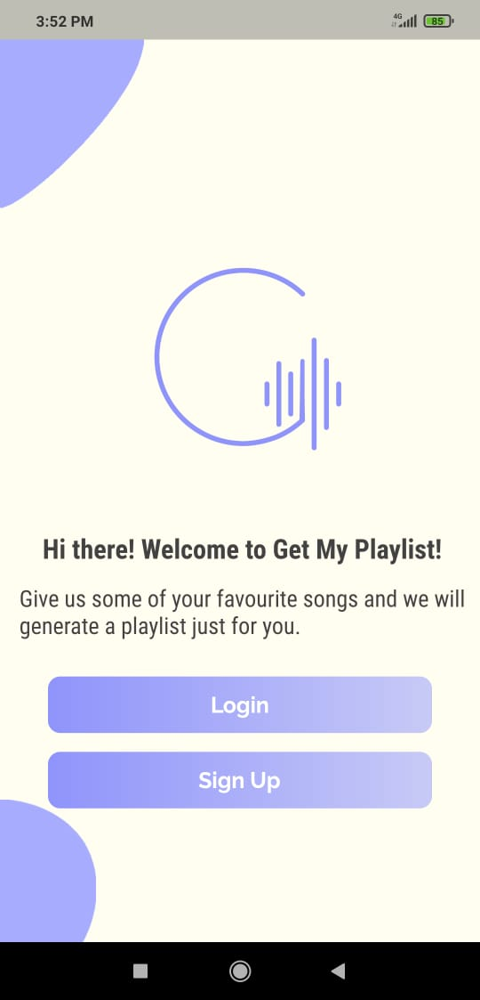
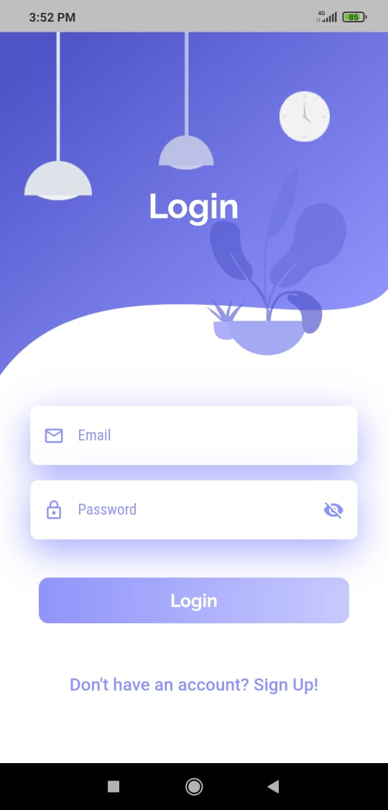
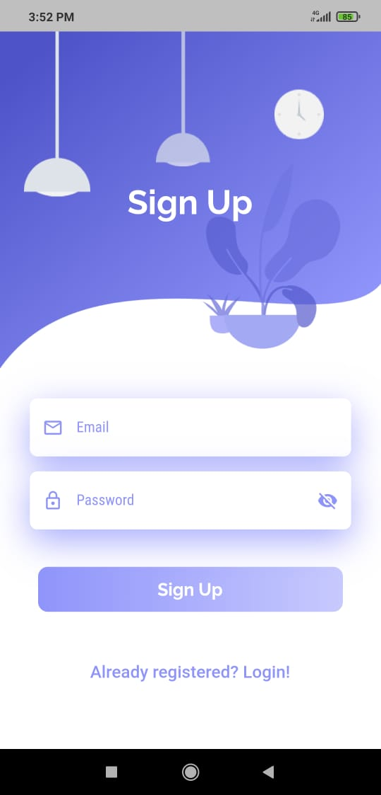
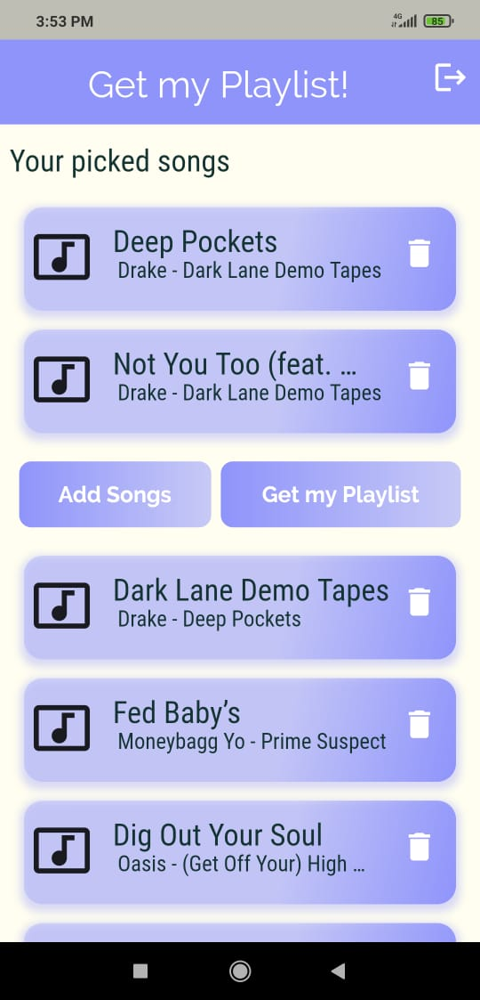
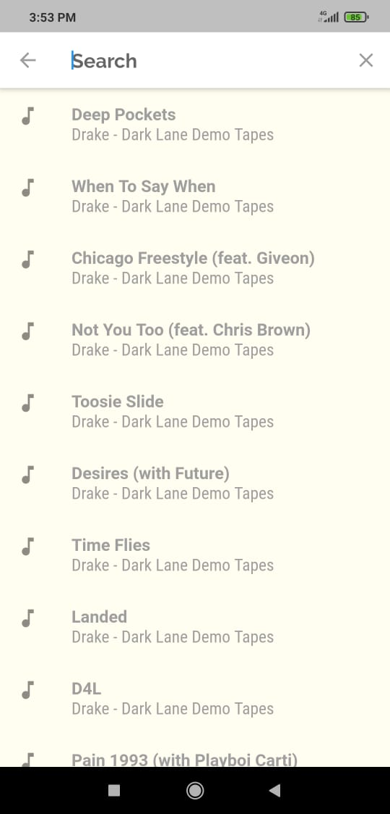

# Get my Playlist

Get My Playlist is an Android app that takes several songs as input from users and returns some playlists. The playlist will include song titles, artist names, cover art, and song links (if copyrights are granted) so that users can listen to those songs.

# Features

- Beautiful and user-friendly UI
- Over 60k songs are included in this data set
- Finding songs quickly and easily
- Generate a playlist that is unique to you
- Login/Sign Up feature to join our community

# Tech Stack

| Target | Stack |
| ------ | ------ |
| Front end | Flutter |
| API Creation | Flask |
| Backend | mongoDB |

# Snapshots

&nbsp;&nbsp;&nbsp;&nbsp;&nbsp;&nbsp;&nbsp;&nbsp;&nbsp;&nbsp;&nbsp;&nbsp;&nbsp;&nbsp; &nbsp;&nbsp;&nbsp;&nbsp;&nbsp;&nbsp;&nbsp;&nbsp;&nbsp;&nbsp;&nbsp;&nbsp;&nbsp;&nbsp;

# Demo

https://user-images.githubusercontent.com/62962186/119789689-e9ddfc80-bef0-11eb-9785-12d2ef7a45b8.mp4

